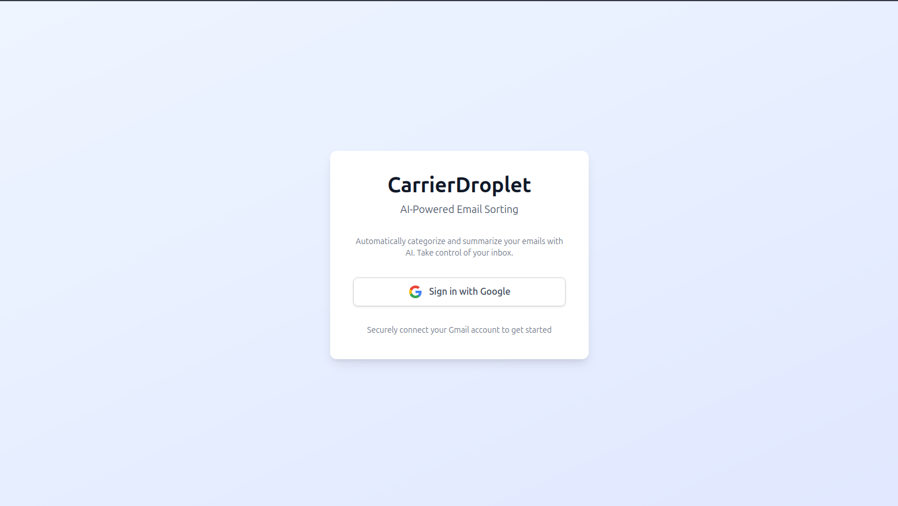
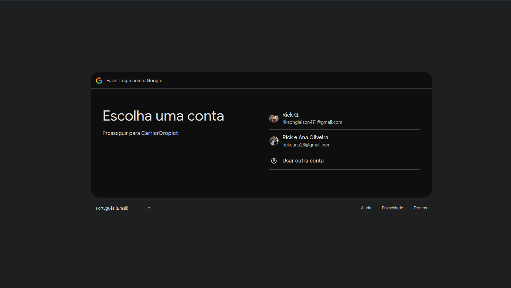
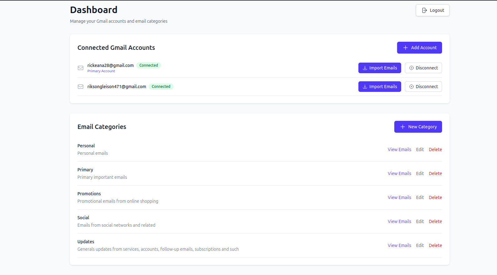
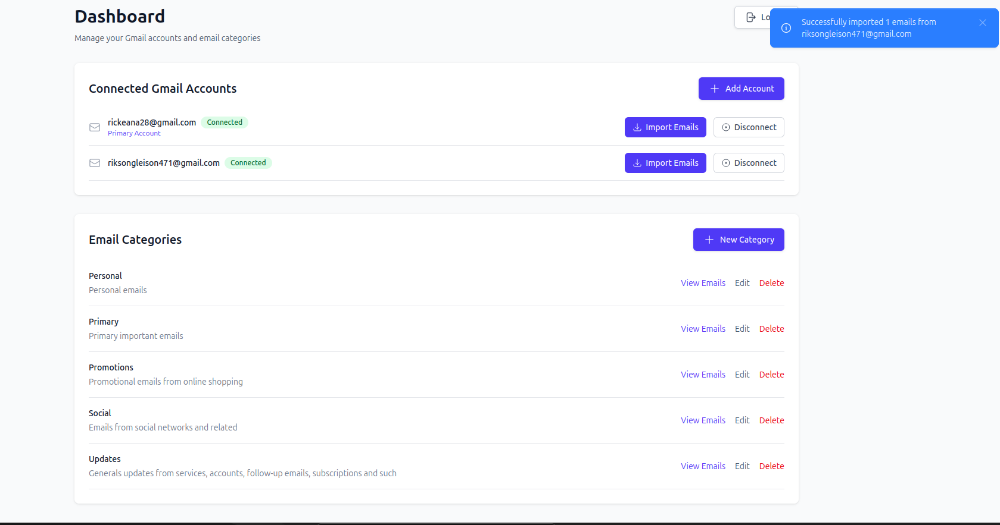

# CarrierDroplet 📧

An AI-powered email management application that automatically categorizes, summarizes, and helps you manage your Gmail inbox with intelligent bulk actions.

### Screens

**Sign In**


**Clean Google sign in**


**Dashboard with support to multilple inboxes**


**Comprehensive notification flashes for background jobs**


## Features

- 🔐 **Google OAuth Integration** - Secure authentication with multi-account support
- 🤖 **AI Email Categorization** - Automatically categorize emails using OpenAI GPT-4
- 📝 **Smart Summaries** - Get AI-generated summaries of your emails
- 🗂️ **Custom Categories** - Create and manage your own email categories
- ⚡ **Bulk Actions** - Select multiple emails for bulk delete or unsubscribe
- 🔄 **Auto-Import** - Scheduled background job imports new emails every 5 minutes
- 🎯 **Intelligent Unsubscribe** - AI agent finds and executes unsubscribe links
- 📊 **Real-time Dashboard** - LiveView-powered interface with instant updates

---

## 🚀 Local Setup

### Prerequisites

- Elixir 1.18+ and Erlang/OTP 27+
- PostgreSQL 14+
- Google Cloud Project with OAuth 2.0 credentials
- OpenAI API key

### Installation Steps

1. **Clone the repository**
   ```bash
   git clone <repository-url>
   cd carrier_droplet
   ```

2. **Install dependencies**
   ```bash
   mix setup
   ```

3. **Set up environment variables**

   Create a `.env` file or export these variables:
   ```bash
   export GOOGLE_CLIENT_ID="your-google-client-id"
   export GOOGLE_CLIENT_SECRET="your-google-client-secret"
   export OPENAI_API_KEY="your-openai-api-key"
   ```

4. **Configure Google OAuth**

   In your Google Cloud Console, add this redirect URI:
   ```
   http://localhost:4000/auth/google/callback
   ```

   Required scopes:
   - `email`
   - `profile`
   - `https://www.googleapis.com/auth/gmail.readonly`
   - `https://www.googleapis.com/auth/gmail.modify`

5. **Start the server**
   ```bash
   mix phx.server
   ```

6. **Visit the app**

   Open [http://localhost:4000](http://localhost:4000) in your browser

---

## 📖 How to Use

### 1. **Connect Your Gmail Account**
   - Click "Sign in with Google" on the homepage
   - Authorize the app to access your Gmail
   - You'll be redirected to your dashboard

### 2. **Create Categories**
   - Navigate to "Categories" in the sidebar
   - Click "New Category"
   - Provide a name and description (the AI uses this to categorize emails)
   - Example: "Newsletters" - "Marketing emails, promotional content, and newsletters"

### 3. **Import Emails**
   - Emails are automatically imported every 5 minutes
   - Or manually trigger import from the dashboard
   - Only unread emails are imported and marked as read

### 4. **View Categorized Emails**
   - Click on any category to see filtered emails
   - Click on an email to view full content
   - AI-generated summaries appear below each email

### 5. **Bulk Actions**
   - Select multiple emails using checkboxes
   - Use "Select All" to select all visible emails
   - Click "Delete Selected" or "Unsubscribe Selected"
   - The AI agent will find and execute unsubscribe links automatically

### 6. **Add Multiple Accounts**
   - Click "Add Account" to connect additional Gmail accounts
   - Switch between accounts from the sidebar
   - Each account has its own categories and emails

### 7. **Disconnect Accounts**
   - Click the disconnect icon next to any account
   - Confirm the action
   - If it's your primary account, your user will be deleted

---

## ⚡ Good Practices & Architecture

### **Phoenix LiveView**
- Real-time UI updates without page refreshes
- Server-rendered HTML with minimal JavaScript
- LiveView streams for efficient list rendering

### **Background Jobs with Oban**
- Scheduled email imports every 5 minutes
- Async email categorization and summarization
- Retry logic with exponential backoff
- Separate queues for different job types

### **Database Design**
- Proper foreign key constraints with cascading deletes
- Indexed columns for fast queries
- Ecto schemas with changesets for data validation

### **Security**
- OAuth 2.0 for authentication
- Automatic token refresh for expired credentials
- Environment variables for sensitive data
- HTTPS enforced in production

### **Code Quality**
- Modular context-based architecture (Accounts, Emails, AI, Gmail)
- Separation of concerns (workers, LiveViews, contexts)
- Comprehensive error handling
- Consistent naming conventions

### **API Integration**
- Gmail API for email operations
- OpenAI API for AI features
- Req library for HTTP requests
- Proper error handling and retries

---

## ✅ Testing

The application has **comprehensive test coverage (78.9%)** with **142 tests**, all passing.

### Test Coverage Highlights

- ✅ **100% coverage** on core schemas (User, GmailAccount, Email, Category, OAuthLinkingToken)
- ✅ **97.2% coverage** on EmailImportWorker (critical background job)
- ✅ **90.6% coverage** on AI Client (categorization and summarization)
- ✅ **87.5% coverage** on UnsubscribeAgent (intelligent unsubscribe)
- ✅ **85%+ coverage** on all background workers
- ✅ **80%+ coverage** on LiveViews and contexts

### Test Types

- **Unit Tests** - All contexts, schemas, and workers
- **Integration Tests** - OAuth flow, email import, AI categorization
- **LiveView Tests** - User interactions, form submissions, real-time updates
- **Mocked Tests** - External APIs (Gmail, OpenAI) using Mimic

### Running Tests

```bash
# Run all tests
mix test

# Run with coverage report
mix coveralls

# Generate HTML coverage report
mix coveralls.html

# Run only unit tests (exclude integration)
mix test --exclude integration
```

---

## 💭 What I Could Have Done Better & Trade-offs

### **Improvements I could make if I had more time**

- **Email Search & Filtering** - Full-text search across email content with advanced filters for date range, sender, and attachments.
- **Performance Optimizations** - Pagination for large email lists, virtual scrolling, database query optimization, and caching for frequently accessed data.
- **More AI Features** - Smart reply suggestions, email priority scoring, spam detection, and sentiment analysis.
- **User Preferences** - Customizable import frequency, email notifications, theme customization (dark mode), and category color coding.

### **Trade-offs Made**

- **Make the tests coverage 100%** - Ensuring full test suite coverage acrross the app.
- **No Email Composition** - Read-only email management focused on inbox management rather than being a full email client replacement.
- **Background Unsubscribe** - Unsubscribe happens in background without immediate feedback, though real-time progress updates via PubSub could be added.
- **No Email Threading** - Emails shown as flat list rather than grouped by conversation due to Gmail API threading complexity.
